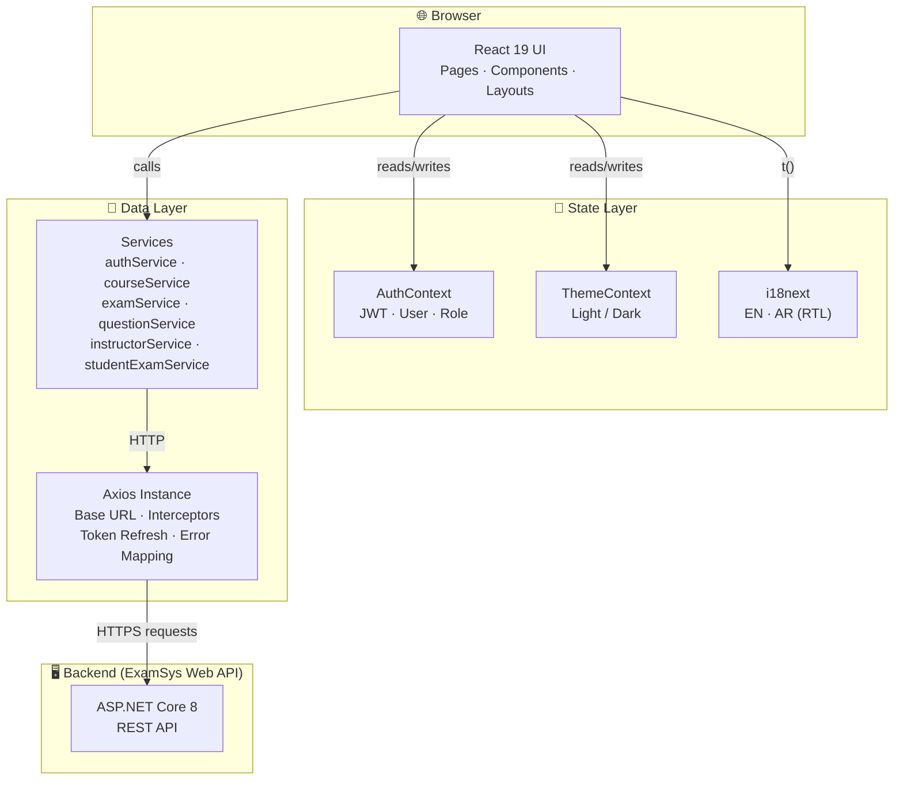
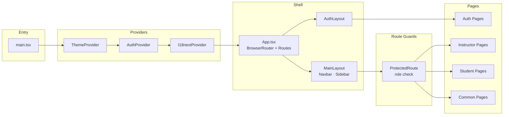
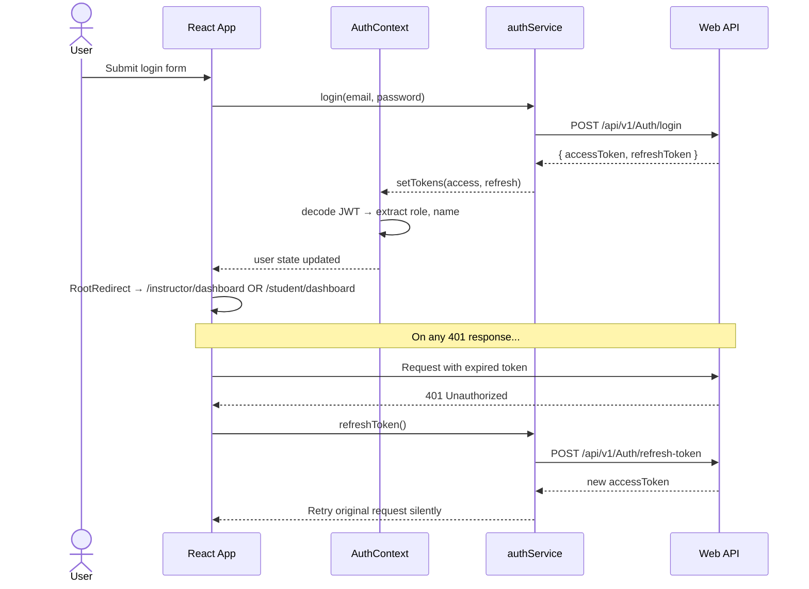
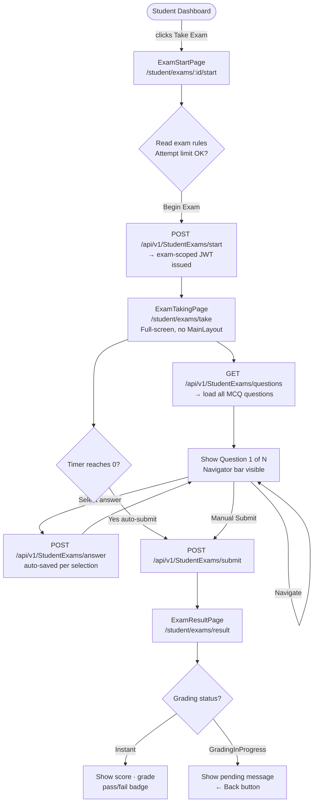
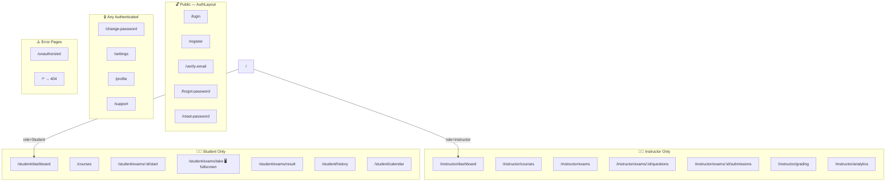
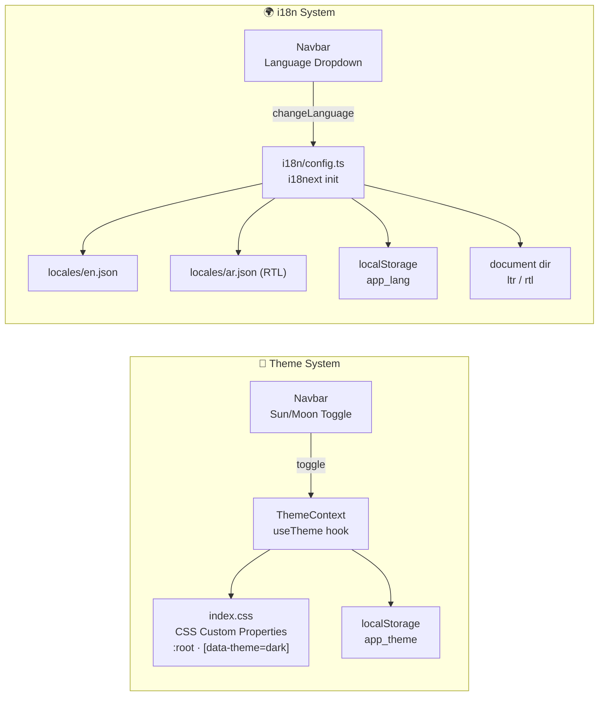
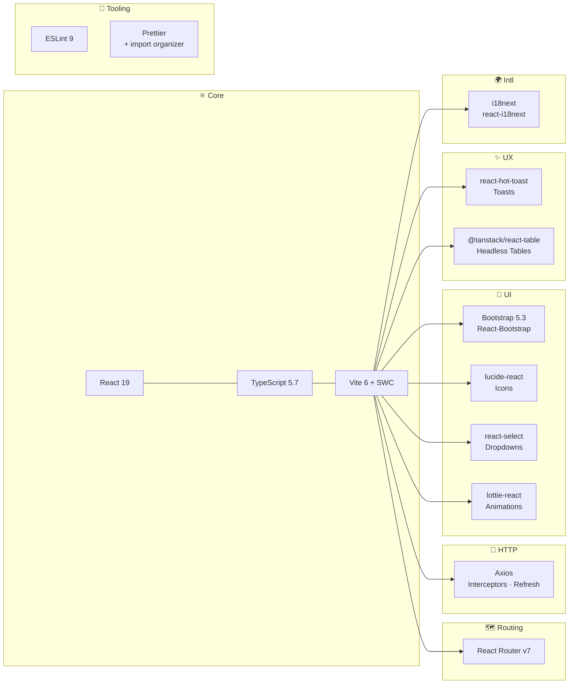

# 🎓 ExamSys — Examination System Frontend

<div align="center">


**A production-ready, role-based examination management frontend built with React 19 + TypeScript**

[Features](#-features) • [Architecture](#-architecture) • [Getting Started](#-getting-started) • [Pages & Routes](#-pages--routes) • [Backend API Repository](https://github.com/ahmads1990/ExaminationSystemWebAPI) • [Contributing](#-contributing)

</div>

---

> ⚙️ **Backend Project**: The ASP.NET Core Web API for this application is hosted at [https://github.com/ahmads1990/ExaminationSystemWebAPI](https://github.com/ahmads1990/ExaminationSystemWebAPI).

## 📖 Overview


**ExamSys Frontend** is the client-side counterpart to the [ExaminationSystem Web API](https://github.com/ahmads1990/ExaminationSystemWebAPI). Built with **React 19**, **TypeScript**, and **Vite**, it delivers a fully-featured examination platform for two distinct user roles — Instructors and Students — with a clean, responsive UI that adapts to both light and dark modes.

The application handles the full academic lifecycle: from registration and email verification, through course management and exam creation, to real-time timed exam-taking with a countdown timer, automatic submission, and instant result display.

### 🎯 Key Highlights

- 🏗️ **Feature-Sliced Structure** — Pages, services, API layer, and components organized by domain
- 👥 **Dual-Role UX** — Completely separate Instructor and Student flows with role-based route guards
- 🔐 **Dual-Token Auth** — JWT + Refresh Token with silent refresh via Axios interceptors
- ⏱️ **Timed Exam Engine** — Live countdown derived from the exam-scoped JWT `exp` claim with auto-submit
- 🌍 **i18n Ready** — Full English & Arabic (RTL) localization via `i18next`
- 🌙 **Dark Mode** — CSS custom-property theming persisted in `localStorage`
- 📱 **Fully Responsive** — Mobile-first layouts with collapsible sidebar drawer
- ✨ **Polished UX** — Loading skeletons, empty states, toast notifications, and animated transitions

---

## ✨ Features

### 🔐 Authentication & Account Management
- Role-based registration for **Students** and **Instructors** (tabbed form)
- OTP-based **email verification** with resend support
- **Forgot / Reset Password** flow via email link
- **Change Password** from the authenticated dashboard
- Automatic silent token refresh on `401` via Axios interceptor
- Logout with token cleanup

### 🏢 Instructor — Course & Exam Management
- **My Courses** — List, create, edit, and delete courses with enrollment limits
- **Exam Management** — Full lifecycle: Draft → Published → Archived, with per-exam configuration (duration, max attempts, shuffle, pass marks)
- **Question Bank** — Add / edit / delete MCQ questions with Easy / Medium / Hard difficulty and dynamic answer choices
- **Question Assignment** — Assign or unassign questions to exams; partial-rejection feedback shown per item
- **Exam Submissions** — Paginated table of all student attempts per exam (name, status, grade, completion time)
- **Instructor Dashboard** — Course stats cards: enrolled students, exam count, average scores
- **Analytics & Grading** — Dedicated pages for exam analytics and manual grading

### 🎓 Student — Exam Taking Flow
- **Browse & Enroll** — Discover all available courses and enroll in one click
- **Student Dashboard** — Enrolled courses and all available upcoming exams in one view
- **Exam Start Page** — Exam metadata, rules, and attempt limit info before committing
- **Live Exam Taking** — One question at a time, answer auto-saved per selection, question navigator bar showing progress
- **Countdown Timer** — Real-time timer derived from exam-scoped JWT; auto-submits on expiry
- **Exam Results** — Instant score, max grade, pass/fail badge, completion time; handles `GradingInProgress` state gracefully
- **Exam History** — Full paginated history of all past attempts with links to individual results
- **Calendar View** — Upcoming exam schedule at a glance

### 🖥️ Shared & Polish
- **Loading Skeletons** — Pulsing card and table placeholders replace spinners for every list page
- **Empty States** — Contextual icon + message + CTA when lists are empty
- **Global Error Toasts** — API error codes mapped to user-friendly messages via `react-hot-toast`
- **404 / Unauthorized Pages** — Graceful error boundaries for unknown routes and permission violations
- **Dark Mode** — Sun/Moon toggle in the navbar; Bootstrap + custom components both adapt

---

## 🏗️ Architecture

### Source Tree

```
src/
├── api/                    ← Typed request/response DTOs
│   ├── requests/           ← AuthRequests, CourseRequests, ExamRequests, …
│   └── responses/          ← ApiResponse base type, all domain response DTOs
│
├── components/             ← Reusable UI components
│   ├── common/             ← AppPagination, EmptyState, SkeletonCard, SkeletonTable, …
│   ├── instructor/         ← AddCourseModal, QuestionEditor, AssignQuestionsModal, …
│   └── questions/          ← Question-specific sub-components
│
├── contexts/               ← React Contexts (AuthContext, ThemeContext)
├── enums/                  ← Shared enums (ApiErrorCode, ExamAttemptStatus, …)
├── hooks/                  ← Custom hooks (usePagination, …)
├── i18n/                   ← i18next config + locale files (en.json, ar.json)
├── layouts/                ← AuthLayout, MainLayout (sidebar + navbar shell)
├── pages/
│   ├── auth/               ← Login, Register, VerifyEmail, Forgot/Reset/ChangePassword
│   ├── common/             ← Profile, Settings, About, Contact, Help, Privacy, Terms
│   ├── errors/             ← UnauthorizedPage
│   ├── instructor/         ← Dashboard, Courses, Exams, Questions, Submissions, Grading, Analytics
│   └── student/            ← Dashboard, Courses, ExamStart, ExamTaking, ExamResult, History, Calendar
│
├── services/               ← API call functions, one file per domain
├── styles/                 ← Global component styles (components.css, animations)
├── types/                  ← TypeScript interfaces (auth.ts, …)
├── utils/                  ← Shared helpers
├── App.tsx                 ← Route tree (BrowserRouter + role-guarded Route groups)
├── main.tsx                ← App entry point (providers: Auth, Theme, i18n)
└── index.css               ← Design tokens — CSS custom properties for both themes
```

### Layer Diagram



### Component Dependency Map



---

## 🔐 Authentication Flow



---

## ⏱️ Exam Taking Flow



---

## 🗺️ Route Map



---

## 🌙 Theme & i18n Architecture



---

## 🛠️ Tech Stack



| Technology | Version | Purpose |
|------------|---------|---------|
| React | 19 | UI framework |
| TypeScript | ~5.7 | Type safety across the entire codebase |
| Vite + SWC | 6 | Lightning-fast dev server & build |
| React Router DOM | v7 | Client-side routing with nested layouts |
| Axios | ^1.7 | HTTP client with interceptor-based token refresh |
| Bootstrap + React-Bootstrap | 5.3 | Responsive grid, modals, offcanvas, forms |
| i18next + react-i18next | 26 / 17 | Full EN/AR localization with RTL support |
| react-hot-toast | ^2.6 | Non-intrusive toast notifications |
| @tanstack/react-table | v8 | Headless table primitives |
| react-select | ^5.10 | Accessible, searchable dropdowns |
| lucide-react | ^0.563 | Consistent icon set |
| lottie-react / dotlottie-react | — | Animated illustrations for empty & loading states |
| Prettier | — | Opinionated code formatting (import organizer included) |
| ESLint | 9 | Linting with React Hooks + Refresh plugins |

---

## 🚀 Getting Started

### Prerequisites

- **Node.js** ≥ 18
- **npm** ≥ 9
- A running instance of the [ExaminationSystem Web API](https://github.com/ahmads1990/ExaminationSystemWebAPI)

### Installation

```bash
# 1. Clone the repository
git clone https://github.com/ahmads1990/ExaminationSystemReact.git
cd ExaminationSystemReact

# 2. Install dependencies
npm install

# 3. Configure the API base URL
cp .env.example .env
# Edit .env and set VITE_API_BASE_URL to your backend URL
```

### Environment Variables

```env
# .env.example
VITE_API_BASE_URL=https://localhost:7001
```

### Running Locally

```bash
npm run dev
# → http://localhost:5173
```

### Other Scripts

| Command | Description |
|---------|-------------|
| `npm run dev` | Start the Vite dev server with HMR |
| `npm run build` | Type-check & build for production (`dist/`) |
| `npm run preview` | Serve the production build locally |
| `npm run lint` | Run ESLint |
| `npm run format` | Format all files with Prettier |

---

## 📄 Pages & Routes

### 🔐 Auth Pages

| Page | Route | Description |
|------|-------|-------------|
| Login | `/login` | Email + password login |
| Register | `/register` | Tabbed Student / Instructor registration |
| Verify Email | `/verify-email` | OTP input + resend option |
| Forgot Password | `/forgot-password` | Request reset link by email |
| Reset Password | `/reset-password` | Set new password via token |
| Change Password | `/change-password` | Change password while authenticated |

### 👨‍🏫 Instructor Pages

| Page | Route | Description |
|------|-------|-------------|
| Dashboard | `/instructor/dashboard` | Course stats — enrollments, exam counts |
| Courses | `/instructor/courses` | CRUD for courses |
| Exams | `/instructor/exams` | Full exam lifecycle management |
| Questions | `/instructor/exams/:id/questions` | Question bank per exam |
| Submissions | `/instructor/exams/:id/submissions` | Student attempt review |
| Grading | `/instructor/grading` | Manual grading interface |
| Analytics | `/instructor/analytics` | Exam performance analytics |

### 👨‍🎓 Student Pages

| Page | Route | Description |
|------|-------|-------------|
| Dashboard | `/student/dashboard` | Enrolled courses + available exams |
| Courses | `/courses` | Browse all courses, enroll |
| Exam Start | `/student/exams/:id/start` | Exam info & rules before starting |
| Exam Taking | `/student/exams/take` | Full-screen timed exam environment |
| Exam Result | `/student/exams/result` | Score, grade, pass/fail after submission |
| Exam History | `/student/history` | Paginated history of all attempts |
| Calendar | `/student/calendar` | Upcoming exam schedule |

---

## 🌍 Localization (i18n)

The app ships with full **English** and **Arabic (RTL)** support via `i18next`.

```
src/i18n/
├── config.ts          ← i18next initialization (language detection, fallback)
└── locales/
    ├── en.json        ← English translations
    └── ar.json        ← Arabic translations
```

A language switcher in the top navbar lets users toggle between locales at runtime. All UI strings — including navigation labels, form placeholders, error messages, and modal titles — are routed through the `t()` helper.

---

## 🔗 Related Projects

| Project | Repository | Description |
|---------|------------|-------------|
| **ExamSys Web API** | [ExaminationSystemWebAPI](https://github.com/ahmads1990/ExaminationSystemWebAPI) | .NET 8 Clean Architecture backend powering this frontend |

---

## 🤝 Contributing

1. Fork the repository
2. Create a feature branch: `git checkout -b feature/your-feature-name`
3. Commit using conventional commits: `git commit -m "feat: add your feature"`
4. Push the branch: `git push origin feature/your-feature-name`
5. Open a Pull Request

---

## 📜 License

This project is licensed under the **MIT License**.

---

<div align="center">

Made with ❤️ — part of the **ExamSys** full-stack project

</div>
